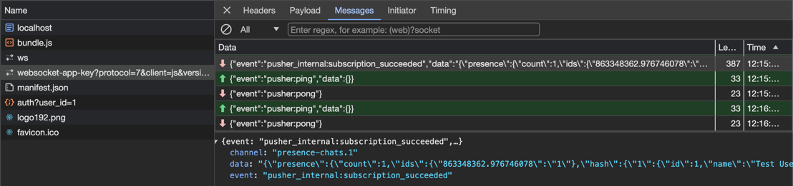

## Setup server
```shell
cd server-reverb
composer install
cp .env.example .env
php artisan migrate
php artisan db:seed
php artisan serve
php artisan reverb:start --host=127.0.0.1 --port=9000
```

## Setup client
```shell
cd client-js
yarn install
yarn run start
```

## How to check issue?
Check the chrome dev 


